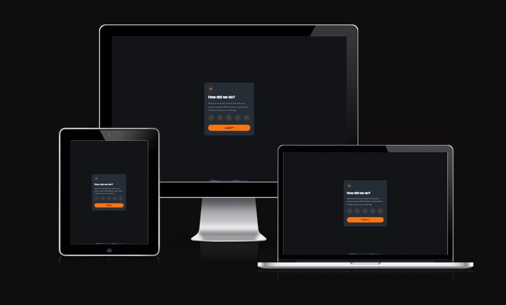

# Frontend Mentor - Interactive rating component

Dies ist eine Lösung für die [Designvorschau für die Codierungsherausforderung für interaktive Bewertungskomponenten](https://www.frontendmentor.io/challenges/interactive-rating-component-koxpeBUmI/hub)

Die Herausforderung besteht darin, diese interaktive Bewertungskomponente so aufzubauen, dass sie dem Design so nahe wie möglich kommt.

Die Benutzer sollten in der Lage sein:

- Zeigen Sie das optimale Layout für die App abhängig von der Bildschirmgröße Ihres Geräts an
- Sehen Sie sich den Hover-Status für alle interaktiven Elemente auf der Seite an
- Wählen Sie eine Zahlenbewertung aus und senden Sie sie ab
- Sehen Sie sich den Kartenstatus „Danke“ an, nachdem Sie eine Bewertung abgegeben haben

## Table of contents

- [Übersicht](#overview)
  - [Screenshot](#screenshot)
  - [Links](#links)
- [Mein Prozess](#my-process)
  - [Erstellt mit](#built-with)
  - [Frameworks](#frameworks)
  - [Tools](#tools)
  - [Was ich gelernt habe](#what-i-learned)
  - [Continued development](#continued-development)
- [Author](#author)

## Übersicht

### Screenshot

### Links

- Solution URL: [Github-Solution](https://github.com/Adem-Tozlu/Frontend-Mentor-Interactive-rating-component)
- Live Site URL: [Website-QR.Code](https://frontend-mentor-interactive-rating-component-nu.vercel.app/)

## Mein Prozess

### Erstellt mit

- Semantic HTML5 markup
- CSS custom properties
- Flexbox
- Mobile-design
- Grid
- Javascript

## Was ich gelernt habe
Während der Weiterbildung vertiefte ich meine Kenntnisse in JavaScript und lernte, wie man diese Sprache effektiv im Browser anwendet. Die praxisorientierten Übungen ermöglichten es mir, meine Fähigkeiten in der Frontend-Entwicklung deutlich zu verbessern.

## Fortsetzung der Entwicklung
Um meine JavaScript-Kenntnisse im Browserkontext weiter zu vertiefen, werde ich in Zukunft weitere Projekte auf Frontend Mentor realisieren.

## Author

- Website - [Github](https://github.com/Adem-Tozlu)
- Frontend Mentor - [@AdemTozlu](https://www.frontendmentor.io/profile/Adem-Tozlu)
- Linkedin - [@Adem-Tozlu](https://www.linkedin.com/in/adem-tozlu-8906b52a5)

